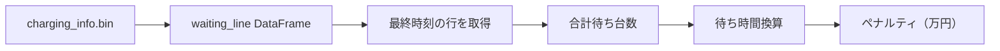

# 終了時待ち台数ペナルティ実装計画（更新版）

## 目的

シミュレーション終了時点の**待ち台数を時間換算**してペナルティとして目的関数に追加する。

## データソース

`charging_info.bin` → `waiting_line` DataFrame（時系列）

```
ElapsedTime | 900000 | 900002 | 900004 | ...
93600       | 3      | 2      | 0      | ...  ← 最終時刻
```

---

## 実装方針



**シミュレータ側の変更は不要**

---

## 詳細設計

### [MODIFY] [cost_calculator.py](file:///home/oums/Desktop/emates/02_src/util/cost_calculator.py)

```python
# 新規追加: 終了時待ち台数ペナルティ
AVG_CHARGING_TIME = 0.5  # 平均充電時間（時間）

def calc_ending_waiting_penalty(waiting_line: pd.DataFrame) -> float:
    """終了時の待ち台数を時間換算してペナルティ計算
    
    Args:
        waiting_line: 時系列の待ち台数DataFrame (index=ElapsedTime, columns=CSID)
    
    Returns:
        ペナルティ（万円）
    """
    # 最終時刻の待ち台数を取得
    final_waiting = waiting_line.iloc[-1].sum()
    
    # 待ち時間換算: 待ち台数 × 平均充電時間
    estimated_wait_hours = final_waiting * AVG_CHARGING_TIME
    
    # 時間価値で換算（待ち時間は2倍）
    penalty = estimated_wait_hours * 2 * TIME_VALUE_OF_MONEY * 365  # 年間換算
    
    print(f"終了時待ち台数: {final_waiting:.0f} 台")
    print(f"推定待ち時間: {estimated_wait_hours:.1f} 時間")
    print(f"待ち台数ペナルティ: {penalty:.1f} 万円/年")
    
    return penalty
```

### [MODIFY] `evaluation_total_costs()` 関数

```diff
def evaluation_total_costs(result_file: str) -> Tuple[float, dict]:
    with open(result_file, 'rb') as f:
        emates_result = pickle.load(f)
    
    # 辞書型とオブジェクト型の両方に対応
    if isinstance(emates_result, dict):
+       waiting_line = emates_result.get('waiting_line')
        ...
    else:
+       waiting_line = emates_result.waiting_line
        ...
    
    # ... 既存コスト計算 ...
    
+   # 終了時待ち台数ペナルティ
+   waiting_penalty = calc_ending_waiting_penalty(waiting_line)
+   waiting_penalty_discounted = sum(
+       (waiting_penalty / ((1 + DISCOUNT_RATE) ** i)) for i in range(1, YEAR + 1)
+   )
    
-   total_costs = initial_costs + running_costs_discounted + additional_costs_discounted
+   total_costs = initial_costs + running_costs_discounted + additional_costs_discounted + waiting_penalty_discounted
    
    return total_costs, emates_result
```

---

## ペナルティ計算式

```
ペナルティ = 終了時待ち台数 × 平均充電時間 × 2 × 時間価値 × 365日
```

| パラメータ | 値 | 説明 |
|-----------|-----|------|
| `AVG_CHARGING_TIME` | 0.5時間 | 1台あたりの平均充電時間 |
| `TIME_VALUE_OF_MONEY` | 1118×10⁻⁴ 万円/時 | 時間価値 |
| 2倍係数 | 2 | 待ち時間は通常の2倍で評価 |

**例**: 終了時待ち 10台 → 10 × 0.5 × 2 × 0.1118 × 365 ≈ **407万円/年**

---

## 検証計画

1. sparse配置でシミュレーション実行
2. `waiting_line.iloc[-1].sum()` が正しく取得されることを確認
3. ペナルティが目的関数に反映されることを確認

---

## 次のアクション

1. [ ] この計画のレビュー・承認
2. [ ] `cost_calculator.py` の修正
3. [ ] テスト実行
