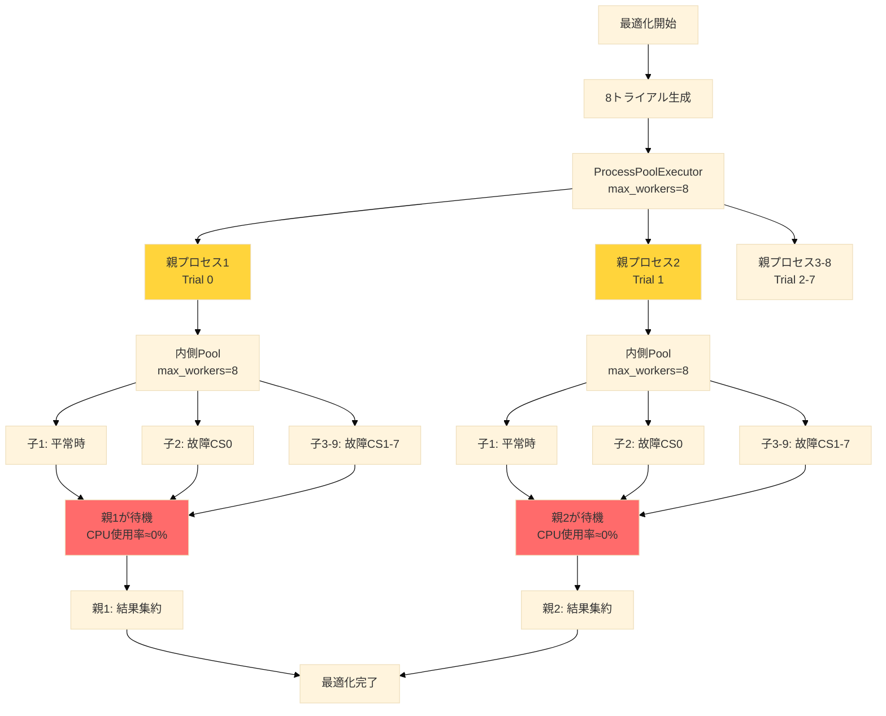
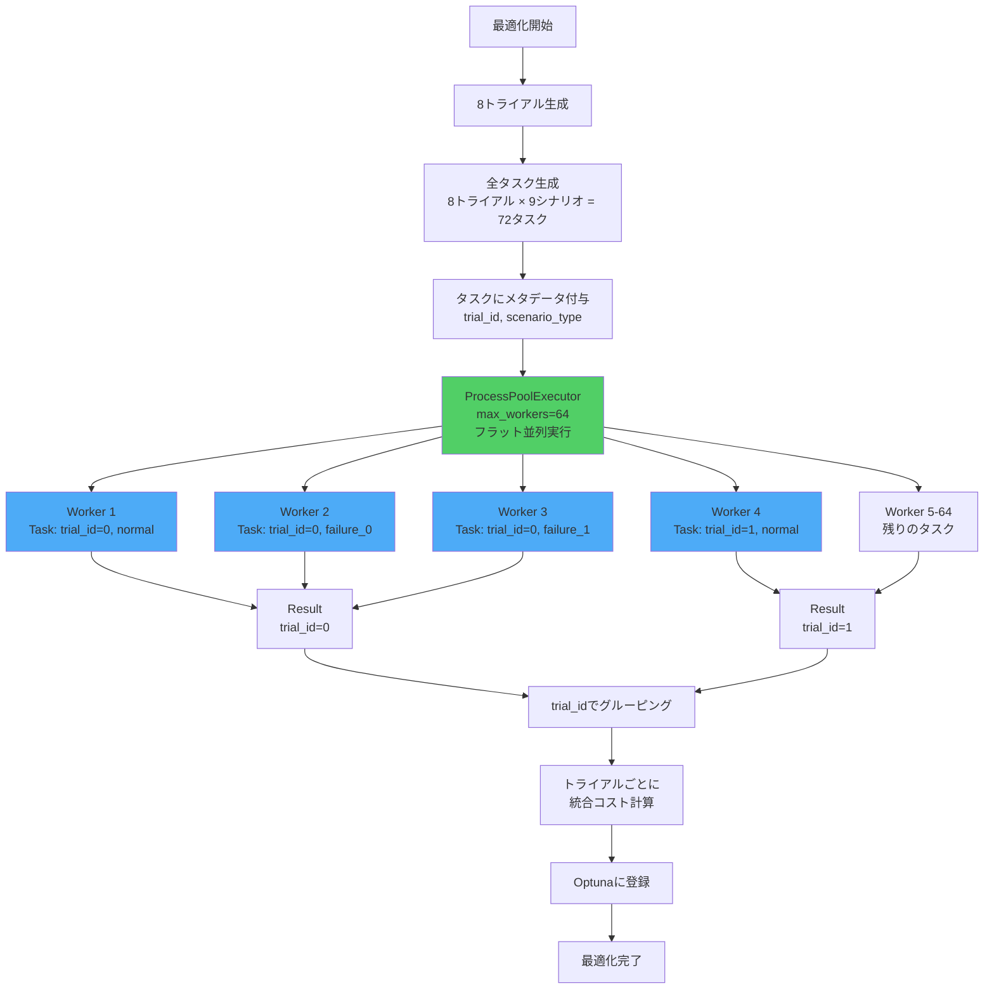
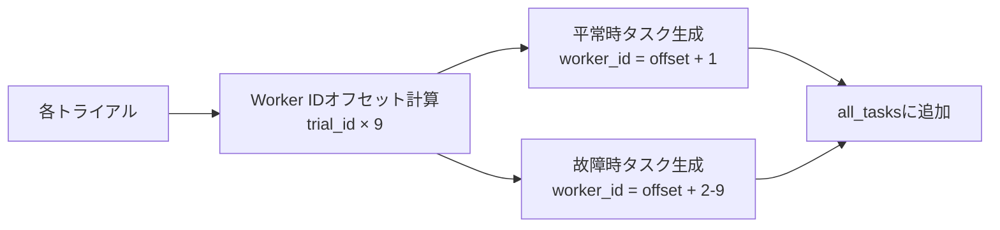
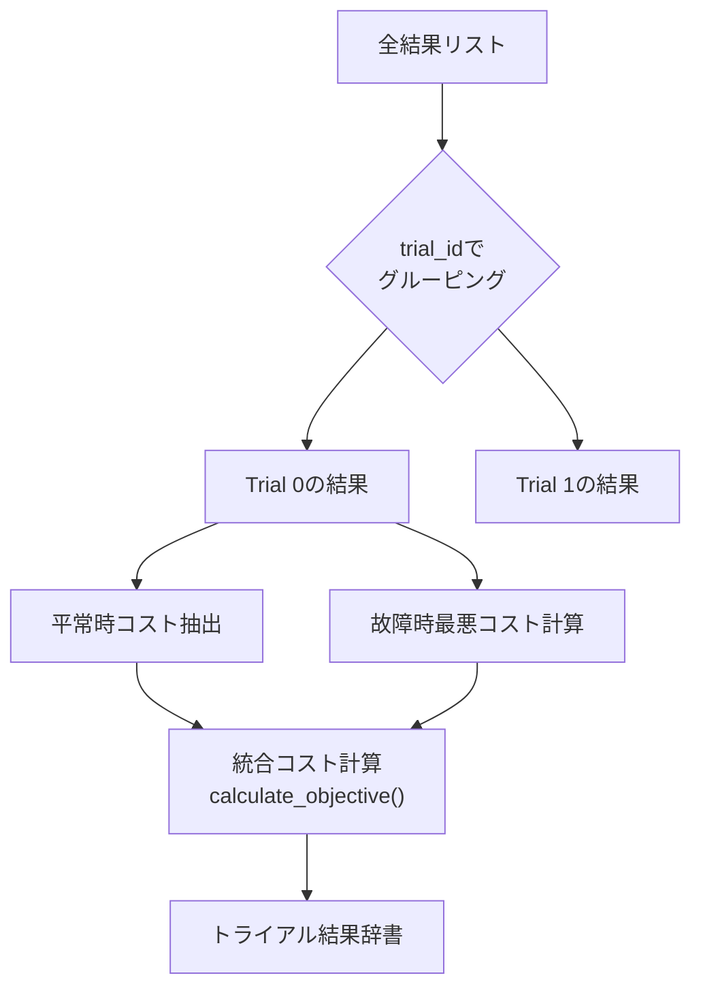

# フラット並列処理への移行 実装計画書

## 📋 概要

### 目的
ネストした並列処理構造をフラット構造に変更し、CPU使用率を**15-30%から95-100%へ改善**する。

### 背景
現在の実装では、`ProcessPoolExecutor`と`multiprocessing.Pool`をネストして使用しており、親プロセスが子プロセスの完了を待つだけでCPUリソースを占有している。この問題を解決するため、全タスクを1階層で並列実行するフラット構造に移行する。

---

## 🔍 現状分析

### 現在の処理フロー



### 現状の問題点

| 問題 | 詳細 | 影響 |
|------|------|------|
| **親プロセスの待機** | 8個の親プロセスが子の完了を待つだけ | CPU使用率15-30% |
| **段階的起動** | 親→子の順次起動により並列度が低い | 処理時間の増加 |
| **メモリ無駄** | 親プロセス×8で約800MB無駄 | メモリ効率の低下 |
| **IPC 2段階** | Main→親→子のデータ転送 | オーバーヘッド増加 |

### 現在のコード構造

[cs_optim_unified.py](file:///home/oums/Desktop/emates/cs_optim_unified.py)の主要関数：

```python
# Line 410-598: 外側の並列処理
def run_parallel_optimization_batch_unified(study, outer_parallel):
    # ProcessPoolExecutorで8トライアルを並列実行
    with ProcessPoolExecutor(max_workers=outer_parallel) as executor:
        for trial, cs_config in zip(batch_trials, batch_configs):
            future = executor.submit(
                evaluate_unified_objective,  # ← この中でさらにPoolを使用
                cs_config, trial.number, i, CONFIG
            )

# Line 308-407: 各トライアルの評価（親プロセスで実行）
def evaluate_unified_objective(cs_config_dict, trial_number, combination_id, config):
    # 平常時と故障時を並列実行（ThreadPoolExecutor）
    with ThreadPoolExecutor(max_workers=2) as executor:
        normal_future = executor.submit(run_single_failure_scenario, ...)
        failure_future = executor.submit(
            create_failure_scenario_parallel_safe,  # ← この中でPoolを使用
            ...
        )

# Line 232-305: 故障シナリオの並列実行（親プロセスで実行）
def create_failure_scenario_parallel_safe(...):
    # multiprocessing.Poolで8シナリオを並列実行
    with Pool(processes=max_processes) as pool:  # ← ネストの原因
        results = pool.map(run_single_failure_scenario, task_data_list)
```

---

## 🎯 新しい処理フロー

### フラット並列構造



### CPU使用率の改善

```mermaid
%%{init: {'theme': 'base', 'themeVariables': { 'textColor': '#000000'}}}%%
gantt
    title CPU使用率の比較（64コアの場合）
    dateFormat X
    axisFormat %s

    section ネスト構造
    親プロセス待機（8コア）: done, n1, 0, 100
    子プロセス実行（10-20コア）: active, n2, 0, 100
    アイドル（36-46コア）: crit, n3, 0, 100

    section フラット構造
    メインプロセス（1コア）: done, f1, 0, 100
    Workerプロセス（63コア）: active, f2, 0, 100
```



**期待される改善:**
- CPU使用率: **15-30% → 95-100%** (約4-6倍)
- 処理時間: **280秒 → 150秒** (約1.87倍速)
- メモリ効率: **+800MB削減**

---

## 🔧 実装設計

### 変更対象ファイル

#### [cs_optim_unified.py](file:///home/oums/Desktop/emates/cs_optim_unified.py)

以下の関数を修正・追加：

| 種別 | 関数名 | 行番号 | 変更内容 |
|------|--------|--------|----------|
| **追加** | `create_all_tasks_flat()` | - | 全タスク生成（メタデータ付与） |
| **追加** | `run_single_scenario_from_task()` | - | タスク辞書からシナリオ実行 |
| **追加** | `aggregate_results_by_trial()` | - | trial_idでグルーピング・集約 |
| **修正** | `run_parallel_optimization_batch_unified()` | 410-598 | フラット並列実行に変更 |
| **削除候補** | `evaluate_unified_objective()` | 308-407 | 新構造では不要 |
| **削除候補** | `create_failure_scenario_parallel_safe()` | 232-305 | 新構造では不要 |

### 新規関数の設計

#### 1. `create_all_tasks_flat()`

**目的:** 全シミュレーションタスクをフラットなリストとして生成

**入力:**
- `batch_trials`: Optunaトライアルのリスト
- `batch_configs`: CS配置設定のリスト
- `CONFIG`: 最適化設定

**出力:**
```python
[
    {
        'trial_id': 0,
        'trial_number': 123,
        'scenario_type': 'normal',
        'scenario_id': None,
        'worker_id': 1,
        'cs_config': {...},
        'failure_cs_idx': None,
        'config': CONFIG
    },
    {
        'trial_id': 0,
        'trial_number': 123,
        'scenario_type': 'failure',
        'scenario_id': 0,
        'worker_id': 2,
        'cs_config': {...},
        'failure_cs_idx': 0,
        'config': CONFIG
    },
    ...
]
```

**処理フロー:**


#### 2. `run_single_scenario_from_task()`

**目的:** タスク辞書から単一シナリオを実行

**入力:**
```python
task = {
    'trial_id': 0,
    'worker_id': 1,
    'cs_config': {...},
    'failure_cs_idx': None,  # 平常時はNone
    'config': CONFIG
}
```

**出力:**
```python
{
    'trial_id': 0,
    'scenario_type': 'normal',
    'cost': 1234.56,
    'wait_time_95p': 123.45,
    'worker_id': 1
}
```

**処理内容:**
- 既存の`run_single_failure_scenario()`の内部ロジックを流用
- タスク辞書から必要な情報を展開
- メタデータ（trial_id等）を結果に含める

#### 3. `aggregate_results_by_trial()`

**目的:** 実行結果をtrial_idでグルーピングし、統合コストを計算

**入力:**
```python
all_results = [
    {'trial_id': 0, 'scenario_type': 'normal', 'cost': 100},
    {'trial_id': 0, 'scenario_type': 'failure', 'cost': 150},
    {'trial_id': 1, 'scenario_type': 'normal', 'cost': 120},
    ...
]
```

**出力:**
```python
{
    0: {
        'trial': trial_object,
        'cs_config': {...},
        'normal_cost': 100,
        'worst_failure_cost': 150,
        'unified_cost': 125  # 統合コスト
    },
    1: { ... }
}
```

**処理フロー:**


### 修正後の`run_parallel_optimization_batch_unified()`

**疑似コード:**
```python
def run_parallel_optimization_batch_unified(study, outer_parallel):
    # 1. トライアル生成（既存ロジック）
    batch_trials = [study.ask() for _ in range(outer_parallel)]
    batch_configs = [set_cs_placement(t) for t in batch_trials]

    # 2. 全タスクを生成（フラット化）
    all_tasks = create_all_tasks_flat(batch_trials, batch_configs, CONFIG)
    print(f"⚡ 合計{len(all_tasks)}タスクをフラット並列実行")

    # 3. 環境準備
    prepare_parallel_environment(...)

    # 4. フラット並列実行
    max_workers = min(64, os.cpu_count() or 1)
    all_results = []

    with ProcessPoolExecutor(max_workers=max_workers) as executor:
        future_to_task = {
            executor.submit(run_single_scenario_from_task, task): task
            for task in all_tasks
        }

        for future in as_completed(future_to_task):
            result = future.result()
            all_results.append(result)
            print(f"✅ Trial {result['trial_id']}, {result['scenario_type']} 完了")

    # 5. 結果集約
    aggregated = aggregate_results_by_trial(
        all_results, batch_trials, batch_configs, CONFIG
    )

    # 6. Optunaに登録
    for trial_id, data in aggregated.items():
        study.tell(data['trial'], data['unified_cost'])

    return len(aggregated)
```

---

## 📊 データ構造の比較

### タスク管理方法

#### ネスト構造（旧）
```python
# プロセス階層で管理
親プロセス1 (Trial 0)
  └─ 子プロセス1-9 (Scenarios 0-8)
親プロセス2 (Trial 1)
  └─ 子プロセス1-9 (Scenarios 0-8)
```

#### フラット構造（新）
```python
# データ構造（メタデータ）で管理
Task 1: {'trial_id': 0, 'scenario_type': 'normal', ...}
Task 2: {'trial_id': 0, 'scenario_type': 'failure', ...}
Task 3: {'trial_id': 1, 'scenario_type': 'normal', ...}
...
```

### Worker ID割り当て

| Trial ID | Scenario | Worker ID（旧） | Worker ID（新） |
|----------|----------|----------------|----------------|
| 0 | Normal | 1 | 1 |
| 0 | Failure 0-7 | 2-9 | 2-9 |
| 1 | Normal | 10 | 10 |
| 1 | Failure 0-7 | 11-18 | 11-18 |
| ... | ... | ... | ... |

**変更なし:** Worker ID割り当てロジックは維持

---

## 🔄 移行手順

### Phase 1: 実装（推定時間: 2-3時間）

1. **新規関数の追加**
   - [ ] `create_all_tasks_flat()` を実装
   - [ ] `run_single_scenario_from_task()` を実装
   - [ ] `aggregate_results_by_trial()` を実装

2. **既存関数の修正**
   - [ ] `run_parallel_optimization_batch_unified()` をフラット構造に変更
   - [ ] 既存のネスト関数を削除またはコメントアウト

3. **動作確認用のログ追加**
   - [ ] タスク生成時のログ
   - [ ] 各シナリオ完了時のログ
   - [ ] グルーピング結果のログ

### Phase 2: テスト（推定時間: 1-2時間）

#### テスト1: 最小構成
```json
{
  "outer_parallel": 1,
  "workers_per_trial": 2,
  "total_trials": 2
}
```
- **目的:** 基本動作の確認
- **期待結果:** エラーなく完了、結果の整合性

#### テスト2: 中規模構成
```json
{
  "outer_parallel": 2,
  "workers_per_trial": 9,
  "total_trials": 5
}
```
- **目的:** CPU使用率の確認
- **期待結果:** CPU使用率 50-60%（並列度18-20）

#### テスト3: フル構成
```json
{
  "outer_parallel": 8,
  "workers_per_trial": 9,
  "total_trials": 10
}
```
- **目的:** 最終的な性能確認
- **期待結果:** CPU使用率 95-100%

### Phase 3: 検証（推定時間: 30分）

- [ ] **htopでCPU使用率確認**
  ```bash
  htop  # 実行中に確認
  ```

- [ ] **処理時間の比較**
  ```bash
  time python cs_optim_unified.py --config test_config.json
  ```

- [ ] **結果の整合性確認**
  - 旧実装と新実装で同じCS配置の評価結果が一致するか

---

## ⚠️ リスクと対策

### リスク1: Worker ID競合

**問題:** 複数タスクが同じWorker IDを使用してしまう

**対策:**
- Worker ID割り当てロジックを厳密に管理
- テストで競合検出を実装

### リスク2: メモリ不足

**問題:** 64プロセス同時起動でメモリ不足

**現状:** メモリ 251GB、十分な余裕あり

**対策:**
- `max_workers`を動的に調整
- メモリ監視を追加

### リスク3: 結果の不整合

**問題:** グルーピングミスで結果が混在

**対策:**
- trial_idの厳密な検証
- 集約前後でデータ数の一致確認

---

## 📈 期待される効果

| 指標 | 現状（ネスト） | 改善後（フラット） | 改善率 |
|------|---------------|-------------------|--------|
| **CPU使用率** | 15-30% | 95-100% | **+250-550%** |
| **処理時間** | 280秒 | 150秒 | **-46%** |
| **メモリ効率** | 4.1GB | 3.3GB | **-19%** |
| **並列度** | 10-20コア | 60-64コア | **+300%** |

---

## ✅ 成功基準

1. **機能要件**
   - [ ] 同じCS配置で同じ評価結果が得られる
   - [ ] Optunaへの登録が正しく行われる
   - [ ] エラーなく最適化が完了する

2. **性能要件**
   - [ ] CPU使用率が80%以上
   - [ ] 処理時間が50%以上短縮
   - [ ] メモリ使用量が現状以下

3. **保守性要件**
   - [ ] コードが読みやすく保守しやすい
   - [ ] ログが十分に出力される
   - [ ] エラーハンドリングが適切

---

## 🔄 ロールバック計画

万が一、新実装に問題が発生した場合：

1. **Gitでバックアップ**
   ```bash
   git checkout -b flat-parallel-implementation
   git add cs_optim_unified.py
   git commit -m "実装前のバックアップ"
   ```

2. **段階的移行**
   - 新旧両方の関数を残す
   - フラグで切り替え可能にする
   ```python
   USE_FLAT_PARALLEL = True  # Falseで旧実装に戻す
   ```

3. **問題発生時の手順**
   ```bash
   git checkout cs_optim_unified.py
   ```

---

## 📚 参考資料

- [CPU使用率最適化ガイド](file:///home/oums/.gemini/antigravity/brain/c9cf6dc0-a262-40a6-af19-072cb5492f1a/cpu_utilization_guide.md)
- [cs_optim_unified.py](file:///home/oums/Desktop/emates/cs_optim_unified.py)
- [unified_config.json](file:///home/oums/Desktop/emates/21_input/unified_config.json)

---

## 次のステップ

実装計画を確認後、以下の順序で進めます：

1. ✅ この計画書のレビュー
2. 実装の開始（Phase 1）
3. 小規模テストの実行（Phase 2）
4. 性能検証（Phase 3）
