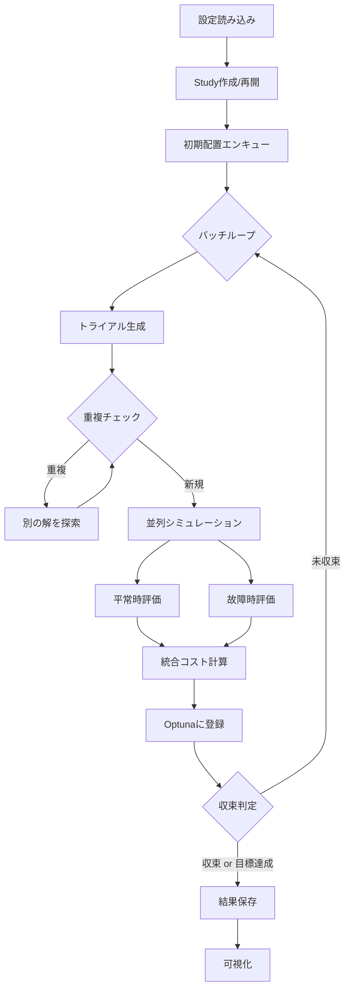

# 統合最適化システム - 使用ガイド

## 概要

平常時と故障時を統合した充電ステーション最適化システムです。Optunaを使用してCS配置を最適化し、平常時コストと故障時コスト（最悪ケース）を統合した目的関数を最小化します。

**目的関数**: `F = (1-P) × 平常時コスト + P × 故障時コスト`

---

## クイックスタート

### 1. 最適化の実行

```bash
cd /home/oums/Desktop/emates
uv run --active cs_optim_unified.py --config unified_config.json
```

### 2. 主なコマンドラインオプション

| オプション | 説明 |
|-----------|------|
| `--config <file>` | 設定JSONファイルを指定（必須） |
| `--no-visualize` | 完了後の可視化をスキップ |
| `--evaluate-only` / `-e` | 初期解のみを評価（最適化スキップ） |
| `--initial-config-name <name>` | 評価する初期解の名前を指定 |

### 3. 実行例

```bash
# 通常の最適化実行
uv run --active cs_optim_unified.py --config unified_config.json

# 初期解のみ評価
uv run --active cs_optim_unified.py --config unified_config.json -e

# 特定の初期解を評価
uv run --active cs_optim_unified.py --config unified_config.json -e --initial-config-name P0
```

---

## 設定ファイル (unified_config.json)

### 主要パラメータ

| パラメータ | 説明 | 例 |
|-----------|------|-----|
| `failure_weight` | 故障時重み (P) | `0.4` → 平常時60%、故障時40% |
| `outer_parallel` | 同時実行トライアル数 | `8` |
| `total_trials` | 目標トライアル数 (COMPLETE) | `1000` |
| `t_hour` | シミュレーション時間（時間） | `26` |
| `initial_cs_config_file` | 初期配置CSVファイル | `"data/initial_cs_configs.csv"` |
| `keep_best_n` | 保持するベストpklファイル数 | `1` |

### 収束判定

| パラメータ | 説明 |
|-----------|------|
| `convergence_patience` | 連続して改善がないトライアル数で収束判定 |
| `convergence_threshold` | 改善率の閾値（例: `0.001` = 0.1%） |

### 目的関数

```json
"objective_function": {
  "name": "weighted_sum",
  "formula": "(1-P) * normal + P * failure",
  "description": "重み付き和（デフォルト）"
}
```

---

## 初期配置ファイル (initial_cs_configs.csv)

CSVフォーマット:

```csv
config_name,csid,capacity_kw,ports
P0,900000,100,1
P0,900002,100,1
P100,900000,100,2
P100,900002,100,1
```

- `config_name`: 配置の名前（同名は同じ配置としてグループ化）
- `csid`: CS識別子
- `capacity_kw`: 充電出力 (50 or 100 kW)
- `ports`: ポート数 (0-4)

---

## 重複パラメータのスキップ機能

同一の実効パラメータ（CS配置）が再提案された場合、自動的に**別の解を探索**します。

### 動作

1. 重複検出時: `↩️ Trial X: 重複検出、別の解を探索中...`
2. 最大10回リトライ
3. PRUNEDとしてマークされ、TPEサンプラーの学習に使用

### ログ表示

```
✅ バッチ完了: 8件登録, 累計12件スキップ (総Trial: 150, COMPLETE: 100, PRUNED: 50)
📈 進捗更新: 100/1000 COMPLETE (総Trial: 150, PRUNED: 50)
```

> **Note**: Trial番号は PRUNED を含むため total_trials より大きくなりますが、**COMPLETEが目標数に達すると終了**します。

---

## 出力

### ディレクトリ構造

```
/srv/samba/share/output/{experiment_name}_P{failure_weight*100}/
├── optuna_study_unified.db    # OptunaのSQLiteデータベース
├── best_result.json           # 最良結果のJSON
├── trial_X_combo_Y_normal.pkl # 平常時結果
├── trial_X_combo_Y_failure_Z.pkl # 故障時結果
├── normal/                    # 平常時可視化
│   ├── optimization_history.png
│   ├── waiting_time_histogram.png
│   ├── trip_time_comparison.png
│   ├── cs_placement_map.png
│   └── results_summary.txt
└── failure/                   # 故障時可視化
    └── (同上)
```

### best_result.json

```json
{
  "best_value": 16079.64,
  "best_trial_number": 5,
  "best_user_attrs": {
    "normal_cost": 16079.64,
    "worst_failure_cost": 16079.64,
    "active_cs_config": [
      {"csid": 900000, "ports": 1, "capacity_kw": 100},
      ...
    ]
  }
}
```

---

## 処理フロー



---

## ファイル構成

```
emates/
├── cs_optim_unified.py              # メインスクリプト
├── unified_config.json              # 設定ファイル
├── data/
│   └── initial_cs_configs.csv       # 初期配置
├── src/
│   ├── config/
│   │   ├── unified_optimization_config.py  # 設定クラス
│   │   └── unified_config_gui.py           # Streamlit GUI
│   ├── simulation/
│   │   ├── run_emates.py            # シミュレーション実行
│   │   └── data_load.py             # 結果読み込み
│   └── util/
│       ├── optimization.py          # 最適化ユーティリティ
│       ├── cost_calculator.py       # コスト計算
│       └── visualize_results.py     # 可視化
└── 00_Agent_Chat_Prompt/
    └── 01_Optimization_Search_Improve/
        ├── 01_(Suggest)Optimization_Search_Improve.md
        ├── 02_Plan.md
        └── 03_Implementation_Report.md
```

---

## トラブルシューティング

### Trial番号が設定より大きい

PRUNEDトライアル（重複スキップ）も番号に含まれます。`COMPLETE` 数が目標に達すると終了するため、動作に問題ありません。

### 収束しない

- `convergence_patience` を増やす
- `n_startup_trials` を調整（初期探索フェーズ）
- 初期配置を追加して探索空間をガイド

### メモリ不足

- `outer_parallel` を減らす
- `keep_best_n` を減らしてpklファイルを削減

---

## 参考資料

- [docs/01_config_settings_GUIDE.md](docs/01_config_settings_GUIDE.md): 設定パラメータ詳細
- [00_Agent_Chat_Prompt/01_Optimization_Search_Improve/](00_Agent_Chat_Prompt/01_Optimization_Search_Improve/): 重複スキップ機能の設計・実装

---

**最終更新**: 2026年1月16日
