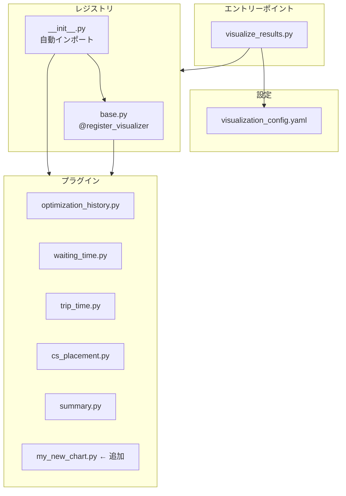

# 可視化プラグインシステム

最適化結果の可視化を拡張可能にするプラグインシステム。

## 使い方

### 基本実行

```bash
# プラグインモード（デフォルト）
uv run python -m src.util.visualize_results -d "Z:\output\unified_P00_P00"

# レガシーモード（プラグインを使用しない）
uv run python -m src.util.visualize_results -d "Z:\output\unified_P00_P00" --legacy
```

### オプション

| オプション | 説明 |
|-----------|------|
| `-d`, `--result-dir` | 結果ディレクトリのパス（必須）|
| `-s`, `--study-name` | Optuna Study名（省略時は自動推測）|
| `-f`, `--result-file` | 対象pklファイル（省略時は最適トライアル）|
| `-c`, `--config` | 設定ファイルパス |
| `--legacy` | レガシーモードで実行 |

---

## アーキテクチャ



---

## 新しい可視化の追加

### 1. ファイルを作成

`src/util/visualizers/` に新しい `.py` ファイルを追加:

```python
# src/util/visualizers/my_new_chart.py
from pathlib import Path
import pickle
from .base import register_visualizer
from rich.console import Console

console = Console()


@register_visualizer(
    name="my_new_chart",           # 設定ファイルで使う名前
    description="新しいグラフ",     # 説明
    output_file="my_new_chart",    # 出力ファイル名
    priority=60,                   # 実行順序（小さい方が先）
)
def plot_my_new_chart(
    result_file: Path,
    save_dir: Path,
    **context,
) -> None:
    """新しいグラフを描画"""

    save_path = save_dir / "my_new_chart.png"

    # pklファイルを読み込み
    with open(result_file, 'rb') as f:
        emates_result = pickle.load(f)

    # 利用可能なプロパティ:
    # - emates_result.cs_config
    # - emates_result.vehicle_trip
    # - emates_result.time_series_kw

    # 描画処理...

    console.print(f"[green]✅ 保存: {save_path}[/green]")
```

### 2. 設定ファイルに追加（任意）

`visualization_config.yaml`:

```yaml
visualizers:
  my_new_chart:
    enabled: true  # falseで無効化
```

---

## デコレータオプション

| パラメータ | デフォルト | 説明 |
|-----------|-----------|------|
| `name` | (必須) | 識別名 |
| `description` | `""` | 説明 |
| `output_file` | `name` | 出力ファイル名（拡張子なし）|
| `requires_study` | `False` | Optuna Studyが必要か |
| `requires_result_file` | `True` | pklファイルが必要か |
| `priority` | `100` | 実行順序 |

---

## context変数

`**context` には以下が含まれます:

| キー | 型 | 説明 |
|-----|---|------|
| `study` | `optuna.Study` or `None` | Optuna Study |
| `result_dir` | `Path` | 保存先ディレクトリ |

---

## ファイル構成

```
src/util/visualizers/
├── __init__.py           # 自動インポート
├── base.py               # デコレータ・レジストリ
├── optimization_history.py
├── waiting_time.py
├── trip_time.py
├── cs_placement.py
├── summary.py
└── README.md             # このファイル
```
